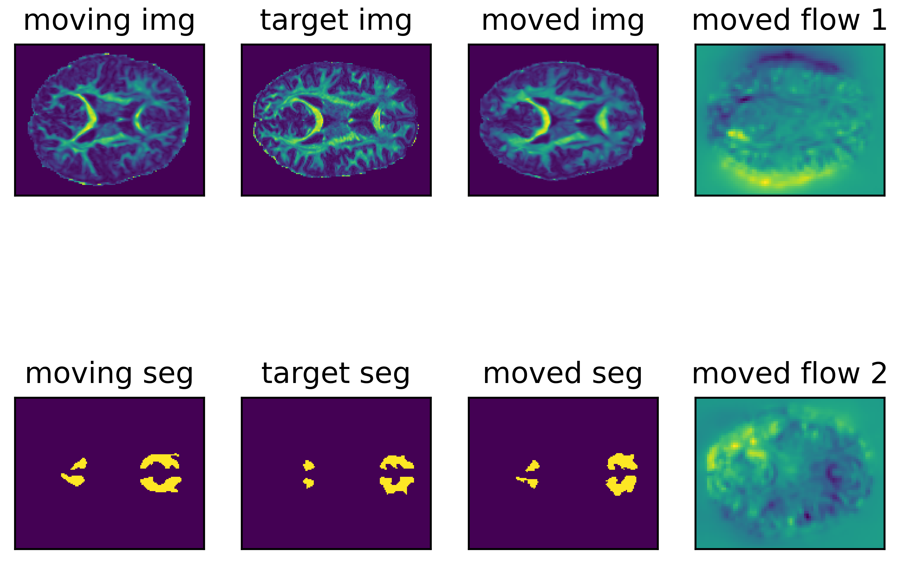

# DDMReg

**D**eep **D**iffusion **M**RI **Reg**istration (DDMReg): A Deep Learning Method for Diffusion MRI Registration. 

This code implements deep learning image registration method using diffusion MRI data, as described in the following paper:

Fan Zhang, William M Wells, and Lauren J O'Donnell.
Deep Diffusion MRI Registration (DDMReg): A Deep Learning Method for Diffusion MRI Registration.
IEEE TMI, 2022. [[publisher's verion]](https://ieeexplore.ieee.org/document/9665765), [[eprint]](https://www.biorxiv.org/content/10.1101/2021.03.04.433968v2), [[supplementary results]](https://www.biorxiv.org/content/10.1101/2021.03.04.433968v2.supplementary-material)

**Installation**:

    conda create --name DDMREG python=3.8.5
    conda activate DDMREG
    pip3 install torch==1.9.0+cu111 torchvision==0.10.0+cu111 torchaudio==0.9.0 -f https://download.pytorch.org/whl/torch_stable.html
    pip3 install joblib scikit-image pystrum nibabel
    pip install jq
    conda install -c mrtrix3 mrtrix

**Example**:

This exmaple shows a registraion of data from a teenager (~10 years old) to data from a healthy adult (~30 years old)).

    git clone git@github.com:zhangfanmark/DDMReg.git
    cd DDMReg
    python ddmreg_register.py --modelDir ./ddmreg_models --movingDir ./test/sub_1/ --targetDir ./test/sub_2/ --outpuDir ./test/sub_1-TO-sub_2

**Results**:

After registraion, the mean Dice score across all tracts is 0.766. This value is 0.535 in the unregistered data.  

Below is a visualization of the registration result. We suggest using [3D Slicer](https://download.slicer.org) for a better visualiztion of the entire 3D FA volume.

**Note**:
1. The testing data includes the direct input of the DDMReg network, i.e., FA and TOM images. The FA image is computed using [SlicerDMRI](http://dmri.slicer.org), and the TOM images are computed using [TractSeg](https://github.com/MIC-DKFZ/TractSeg). 
2. Preprocessing of the orignial images includes rigid registraion to the MNI space, upsampling to 1.25mm isotropic, and image padding to 128 × 160 × 128.
3. The code for re-training a registraion model is under construction.

